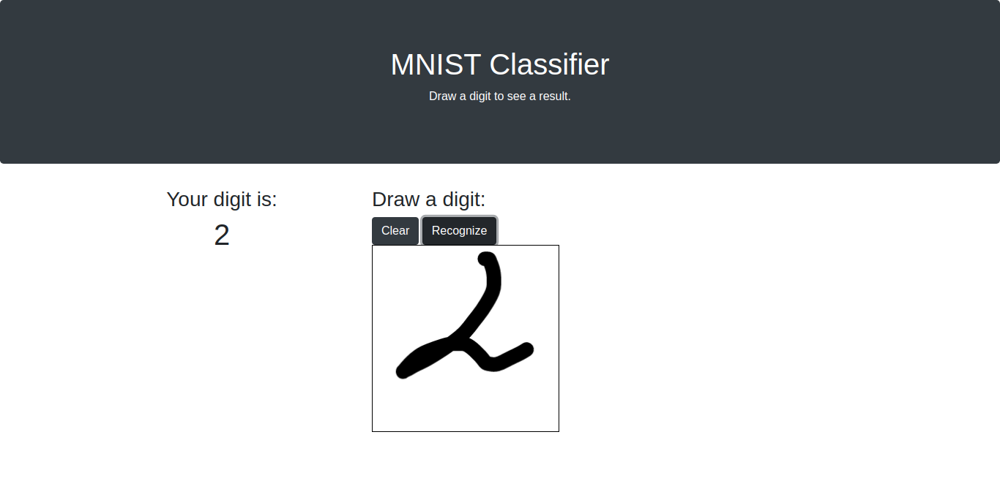

# Image Classifier


WIP: Service to classify images using PyTorch models. Currently hand-written digit recognition is supported.


Web interface is supported: 



Also you can use GRPC interface:
```
syntax = "proto3";

package ImageClassifierGrpc;

message ImageClassificationRequest {
    bytes imageData = 1;
    string classifierType = 2;
}

message ImageClassificationResponse {
    string label = 1;
}

service ImageClassificationService {
    rpc ClassifyImage (ImageClassificationRequest) returns (ImageClassificationResponse) {
    }
}
```
